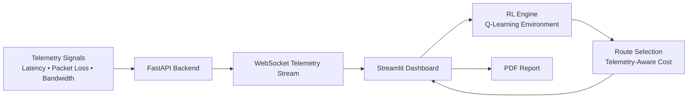
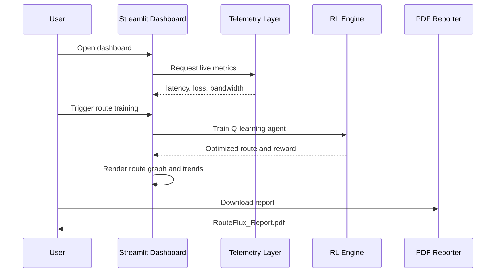
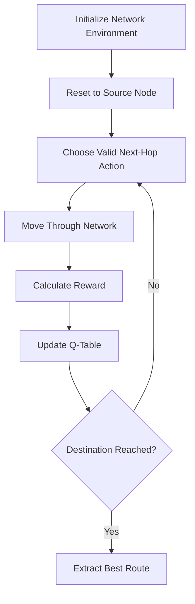

# RouteFlux - Intelligent Multihop Routing Optimizer


> AI-powered network routing that combines live telemetry, Q-learning, and an interactive dashboard to select better multihop paths in changing network conditions.

RouteFlux is a full-stack intelligent routing system built for adaptive path optimization. It collects live telemetry signals, evaluates network health, trains a reinforcement learning agent, selects an optimized route, visualizes the decision, and generates a downloadable engineering report.

---

## 🚀 Demo

| Service | Link |
| --- | --- |
| Frontend Dashboard | [Open Streamlit App](https://intelligent-multihop-routing-gz3ct73yxlu8udan9u2rb8.streamlit.app/) |
| Backend API | [Open Render Backend](https://routeflux-backend.onrender.com/) |
| GitHub Repository | [ashwinnm13/Intelligent-MultiHop-Routing](https://github.com/ashwinnm13/Intelligent-MultiHop-Routing) |

### Preview

| Dashboard | Training | Report |
| --- | --- | --- |
|  |  |  |

---

## 🧩 Problem Statement

Traditional routing systems often rely on static metrics or rule-based path selection. In real-world networks, conditions change constantly: latency spikes, packet loss appears, bandwidth fluctuates, and congestion can move across nodes.

RouteFlux addresses this by building a telemetry-aware routing optimizer that can:

- Observe live network conditions.
- Estimate route quality using latency, packet loss, bandwidth, hops, and reward.
- Train a Q-learning agent to improve path decisions.
- Explain route choices in a human-readable dashboard.
- Produce reports for review, debugging, and operational tracking.

---

## 🏗️ Solution Architecture



### High-Level Components

| Layer | Responsibility |
| --- | --- |
| Telemetry | Collects latency, packet loss, and bandwidth signals. |
| FastAPI | Exposes backend route and health endpoints. |
| WebSockets | Streams telemetry updates to the frontend when available. |
| RL Engine | Runs Q-learning over the network environment. |
| Dashboard | Displays metrics, route decisions, trends, and reports. |
| Reporting | Generates a PDF with route metrics, topology, trends, and reward. |

---

## ✨ Features

### Live Telemetry Collection

- Latency measurement.
- Packet loss estimation.
- Bandwidth signal estimation.
- WebSocket telemetry streaming.
- Frontend fallback to local telemetry collection when the socket is unavailable.

### Intelligent Routing

- Q-learning based routing decisions.
- Dynamic route selection.
- Telemetry-aware route cost and reward evaluation.
- Inference engine for best-route extraction.

### Interactive Dashboard

- Live telemetry metric cards.
- Network health status indicators.
- Selected route visualization.
- Route explanation panel.
- Training trigger from the dashboard.
- Route decision timeline.

### Visualization

- Network topology graph.
- Selected path highlighting.
- Latency trend chart.
- Packet loss trend chart.

### Reports

- Downloadable PDF report.
- Includes live metrics, route, health status, topology visualization, trends, and estimated reward.

### Training System

- Reinforcement learning environment.
- Q-learning agent.
- Route inference module.
- Telemetry-conditioned optimization.

---

## 🛠️ Tech Stack

| Category | Technologies |
| --- | --- |
| Language | Python 3.12+ |
| Frontend | Streamlit, Streamlit Autorefresh |
| Backend | FastAPI, Uvicorn, WebSockets |
| Machine Learning | Q-Learning, custom RL environment |
| Networking | ping3, WebSocket telemetry |
| Graphs | NetworkX, Matplotlib |
| Data & Charts | Pandas, Altair |
| Reporting | ReportLab |
| Testing | Pytest |
| Deployment | Streamlit Community Cloud, Render |

---

## 📦 Installation

Clone the repository:

```bash
git clone https://github.com/ashwinnm13/Intelligent-MultiHop-Routing.git
cd Intelligent-MultiHop-Routing
```

Create and activate a virtual environment:

```bash
python -m venv .venv
```

Windows:

```bash
.venv\Scripts\activate
```

macOS/Linux:

```bash
source .venv/bin/activate
```

Install dependencies:

```bash
pip install -r requirements.txt
```

---

## 💻 Local Setup

### 1. Run the WebSocket Telemetry Backend

Run this on port `8000` when using the Streamlit dashboard locally, because the frontend reads telemetry from `ws://127.0.0.1:8000/telemetry`.

```bash
uvicorn backend.ws_server:app --reload --port 8000
```

Telemetry socket:

```text
ws://127.0.0.1:8000/telemetry
```

### 2. Run the FastAPI REST Backend

If you want to run the REST API at the same time as the WebSocket telemetry server, use a second port:

```bash
uvicorn backend.main:app --reload --port 8001
```

REST API:

```text
http://127.0.0.1:8001
```

Route endpoint:

```text
http://127.0.0.1:8001/route
```

### 3. Run the Streamlit Dashboard

```bash
streamlit run frontend/app.py
```

Default URL:

```text
http://localhost:8501
```

### 4. Run Tests

```bash
pytest
```

---

## ☁️ Deployment

| Component | Platform | URL |
| --- | --- | --- |
| Frontend | Streamlit Community Cloud | [Dashboard](https://intelligent-multihop-routing-gz3ct73yxlu8udan9u2rb8.streamlit.app/) |
| Backend | Render | [API](https://routeflux-backend.onrender.com/) |

### Frontend Deployment Notes

The Streamlit app entry point is:

```text
frontend/app.py
```

The deployed dashboard supports live metric display, route training, topology visualization, trend charts, and PDF report downloads.

### Backend Deployment Notes

The backend can expose:

| Module | Purpose |
| --- | --- |
| `backend.main:app` | REST API for health and route inference. |
| `backend.ws_server:app` | WebSocket telemetry streaming service. |

---

## 🧭 Usage

1. Open the deployed Streamlit dashboard.
2. Review the live telemetry cards for latency, packet loss, and bandwidth.
3. Enable live mode to refresh telemetry periodically.
4. Click **Train Route** to train the Q-learning agent on the current telemetry snapshot.
5. Inspect the selected route, route explanation, reward, and network health status.
6. Review latency and packet loss trend charts.
7. Download the generated PDF report for documentation or analysis.

---

## 🔁 Project Workflow



---

## 🧠 Reinforcement Learning Flow

RouteFlux models routing as a reinforcement learning problem:

| RL Concept | RouteFlux Mapping |
| --- | --- |
| State | Current network node. |
| Action | Select next valid neighbor node. |
| Reward | Route quality score based on latency, packet loss, hops, and telemetry cost. |
| Episode | One attempt to reach the destination node. |
| Policy | Learned Q-table used to select high-value routing actions. |



---

## 🖼️ Screenshots

Add screenshots to the `assets/` directory with the following names:

```text
assets/dashboard.png
assets/training.png
assets/report.png
```

| Screenshot | Description |
| --- | --- |
| `assets/dashboard.png` | Main RouteFlux dashboard with live telemetry cards and network status. |
| `assets/training.png` | Training workflow with selected route, metrics, and route explanation. |
| `assets/report.png` | Generated PDF report preview with graphs and route details. |

---

## 📈 Performance Notes

- The current Q-learning loop is lightweight and suitable for demo-scale topologies.
- Telemetry-aware rewards allow routing decisions to react to changing network quality.
- Streamlit session state stores recent latency/loss history for dashboard trend charts.
- The frontend includes a fallback telemetry path, so the dashboard remains usable when the WebSocket service is unavailable.
- For larger topologies, route training episodes, exploration strategy, and reward weights should be tuned to control convergence time.

---

## 🗂️ Folder Structure

```text
Intelligent-MultiHop-Routing/
├── assets/
│   ├── dashboard.png
│   ├── training.png
│   └── report.png
├── backend/
│   ├── main.py
│   ├── ws_server.py
│   ├── telemetry.py
│   ├── network_collector.py
│   ├── metrics.py
│   ├── report.py
│   ├── explainer.py
│   └── network_health.py
├── frontend/
│   ├── app.py
│   ├── live_telemetry.py
│   └── visualizer.py
├── rl_engine/
│   ├── environment.py
│   ├── q_learning.py
│   ├── train.py
│   ├── inference.py
│   ├── rewards.py
│   └── topology.py
├── tests/
│   ├── test_api.py
│   ├── test_metrics.py
│   ├── test_qlearning.py
│   ├── test_reward.py
│   └── test_topology.py
├── requirements.txt
├── pyproject.toml
├── pytest.ini
└── README.md
```

---

## 🧪 API Reference

### Health Check

```http
GET /
```

Example response:

```json
{
  "message": "Intelligent Multi-Hop Routing API is running. Use the /route endpoints to interact with the model."
}
```

### Route Inference

```http
GET /route
```

Returns the selected route with route-level metrics.

### Telemetry WebSocket

```text
ws://127.0.0.1:8000/telemetry
```

Example message:

```json
{
  "latency": 24.8,
  "loss": 1,
  "bandwidth": 75.2
}
```

---

## 🔮 Future Scope

- Integrate real telemetry from routers, SDN controllers, or cloud network observability systems.
- Add dynamic topology discovery instead of static graph definitions.
- Support automatic retraining when congestion or packet loss crosses thresholds.
- Deploy lightweight inference at the edge for low-latency routing decisions.
- Add Kubernetes scaling for independent frontend, API, telemetry, and RL workers.
- Persist historical telemetry and route decisions for long-term analysis.
- Add policy comparison between shortest path, telemetry-weighted path, and RL-selected path.

---

## 💼 Resume Impact

- Built an AI-powered multihop routing optimizer using Q-learning to adapt route selection based on live latency, packet loss, and bandwidth telemetry.
- Developed a full-stack observability dashboard with Streamlit, FastAPI, WebSockets, topology visualization, route explanations, and downloadable PDF reports.
- Designed a reinforcement learning environment for network routing with telemetry-aware rewards, route inference, and automated decision tracking.
- Deployed a production-style ML systems project across Streamlit Community Cloud and Render with tests, modular architecture, and recruiter-friendly documentation.

---

## 🤝 Contributing

Contributions are welcome. To propose a change:

1. Fork the repository.
2. Create a feature branch.
3. Make a focused change with tests where appropriate.
4. Run `pytest`.
5. Open a pull request with a clear description of the problem and solution.

Good contribution areas include reward tuning, topology discovery, real telemetry integrations, dashboard improvements, and deployment automation.

---

## 📄 License

This project is licensed under the [MIT License](LICENSE).

---

## 👤 Author

**Ashwinn M**

- GitHub: [@ashwinnm13](https://github.com/ashwinnm13)
- Project: [RouteFlux - Intelligent Multihop Routing Optimizer](https://github.com/ashwinnm13/Intelligent-MultiHop-Routing)

---

## ⭐ Project Summary

RouteFlux demonstrates how reinforcement learning, live network telemetry, real-time dashboards, and production-oriented reporting can work together to make network routing more adaptive, observable, and explainable.
